# PicoCal Space-Time Transformer

<p>
  
  
  
  
  
  
</p>

Photon energy reconstruction for the **LHCb PicoCal** (Upgrade II electromagnetic calorimeter) under
minimum-bias pileup, using a token transformer with a physics-structured readout — benchmarked against
BDT and calibrated-sum baselines, with a fully scripted, seed-exact reproducible pipeline.

> Google Summer of Code 2026 — CERN-HSF
> ([program page](https://hepsoftwarefoundation.org/activities/gsoc.html) ·
> [2026 projects](https://hepsoftwarefoundation.org/gsoc/2026/summary.html)).
> Developed openly and documented for handoff to the LHCb group.

---

## The core claim: PicoCal's timing helps exactly where it matters

PicoCal records per-cell **timing** — information ordinary ECALs don't have. The central question of this
project is whether that extra data genuinely improves reconstruction under real minimum-bias pileup.
Answer, with its negative control:

<picture>
  <source media="(prefers-color-scheme: dark)" srcset="assets/timing-dark.svg">
  
</picture>

Same token pipeline, one change — include the per-cell time features or not. On the clean sample timing is
dead weight; under pileup it removes a fifth of the resolution width. **Timing is a pileup tool, and PicoCal
is the calorimeter that has it.**

> **How this connects to the numbers below:** 0.0541 isolates the effect of *timing alone* in a controlled
> pair — nothing else differs. The optimization ladder below starts from a timing model and adds every other
> lever (gated readout, quantile head, qd loss, EMA, TTA, calibration) to reach 0.0402:
> `0.0671 ──(+time only)──▶ 0.0541 ──(+everything else)──▶ 0.0402`.

## Headline result

**Aggregate σ_eff on the minimum-bias test split: `0.0402`** (conservative least-squares calibration: `0.0411`),
down from `0.0485` at the start of the optimization campaign (**−17.1%**), with every step mechanism-verified
against a pre-registered criterion. A **single** EMA model matches the previous 5-model ensemble.

σ_eff = half-width of the smallest 68.3% interval of (E_pred − E_true)/E_true. Uncertainty per bin: 0.96·σ_eff/√n;
differences below 0.002 are treated as noise throughout.

<picture>
  <source media="(prefers-color-scheme: dark)" srcset="assets/ladder-dark.svg">
  
</picture>

### Benchmark (minimum-bias test split, seed-averaged)

<picture>
  <source media="(prefers-color-scheme: dark)" srcset="assets/benchmark-dark.svg">
  
</picture>

| Model | σ_eff | Notes |
|---|---|---|
| BDT (fair feature baseline) | 0.1253 | HistGradientBoosting on aggregate features |
| GateHuber transformer (pre-campaign best) | 0.0463 | 5 seeds |
| SubNet W4 + clean-aux (Huber) | 0.0452 | subtract-then-calibrate readout |
| + quantile head, per seed | 0.0438 – 0.0448 | 5 seeds |
| **+ qd loss + EMA, per seed** | **0.0412 – 0.0426** | 5 seeds, spread collapses |
| **Full stack: qd+EMA ×5 + D4 TTA + joint width calibration** | **0.0402** | LS-calibration variant: 0.0411 |
| Clean-sample reference (no pileup) | 0.0397 | pileup penalty of the final model ≈ 0.003 |

### Per-bin resolution vs. physics floor (final stack)

| E bin (GeV) | 2.2–10.7 | 10.7–17.4 | 17.4–24.0 | 24.0–34.1 | 34.1–53.1 | 53.1–100 |
|---|---|---|---|---|---|---|
| σ_eff | 0.0625 | **0.0447** | **0.0336** | 0.0336 | 0.0326 | 0.0331 |
| target | 0.060 | 0.045 ✓ | 0.035 ✓ | 0.032 | 0.030 | 0.030 |

The quantile-metric floor of the assumed design resolution (10%/√E ⊕ 1%) on this spectrum is **0.0235**.
The measured remaining gap decomposes into ~0.010 of *photonic* in-window pileup (overlapping photons —
shown to be invisible to timing vetoes, shower-shape template fits, and every label-free mechanism tested)
plus ~0.005 reconstruction above floor.

### Optimization ladder (each step pre-registered, ≥2 seeds)

| Step | σ_eff | Mechanism |
|---|---|---|
| GateHuber baseline | 0.0485 | time-gated Huber transformer |
| subtract-then-calibrate + W=4 + clean-aux + ensembling | 0.0440 | free-learned per-cell signal gate |
| quantile head + width-binned recalibration | 0.0437 | per-event uncertainty drives calibration groups |
| direct σ_eff calibration (joint fit on validation) | 0.0419 | align the calibration objective with the metric |
| EMA weight averaging (decay 0.999) | 0.0416 | single model ≈ previous 5-model ensemble |
| coverage-width (qd) training loss | **0.0402** | trainable surrogate of the 68%-interval metric |

## Architecture

<picture>
  <source media="(prefers-color-scheme: dark)" srcset="assets/architecture-dark.svg">
  
</picture>

The design principle is **physics-structured simplicity**: a compact transformer whose *readout* carries the
physics (a learnable calibrated sum over a per-cell signal gate, plus a residual head), trained with a loss
shaped like the evaluation metric. Deliberately simple wiring is a *result*, not a limitation — every fancier
alternative (teacher–student distillation, GravNet, pairwise attention, Swin-style bias, CNN stems, double
depth/width, iterative refinement) was trained on this data and measured flat or worse; see below.

## The falsification record

The campaign tested **~24 hypotheses across every family** available without per-cell truth labels, all under one
protocol (fixed splits, pre-registered win criterion, ≥2 seeds, validation-only selection). Highlights of what
did **not** work — each with a measured mechanism, documented in its own notebook:

- **Supervision pressure** — synthetic overlay labels, DANN, feature distillation, aggregate-fraction (LLP)
  supervision, containment auxiliary head: all flat or harmful. The *free-learned* gate reaches r = 0.92 with the
  true per-cell signal fraction without ever seeing one.
- **Time representations** — pairwise Δt attention, TOF-corrected pulls, out-of-time tail features, one-sided
  hadron-TOF veto, longitudinal (front–back) EM-development pull: all flat. Measured cause: the in-window pileup
  is predominantly **photonic** and in-time — indistinguishable from signal at σ_t ≈ 0.25 ns.
- **Architectures** — GravNet, pairwise attention, Swin-style relative bias, width ×2, depth ×2, CNN/conv-stem
  hybrid, iterative refinement, DRN-class ideas: 0-for-10. Every gain came from objective/training, not wiring.
- **Physics-template deblending** — a Lednev/Grindhammer 2-blob fit (template measured from clean data) *does*
  recover per-event pileup energy (partial corr 0.637 | ΣE), but feeding its outputs to the network adds nothing:
  the information is already in the cells; the irreducible part is in-core overlap degeneracy.

Full record: `reports/lever_matrix.md`, `reports/spec_road_to_0p0235.md`, and notebooks 21–62.

## Quick start

```bash
git clone https://github.com/Lworakan/GSoC2026-picocal-spacetime-transformer.git
cd GSoC2026-picocal-spacetime-transformer
# environment: torch >= 2.6, uproot, awkward, numpy, pandas, scipy, plotly, nbformat

# reproduce the champion (5 seeds, GPU, ~3 h) — checkpointed and resumable
python scripts/train_picocal.py --sample minbias --cleanaux --seeds 0 1 2 3 4

# train on the clean sample instead — same script, one flag
python scripts/train_picocal.py --sample clean --seeds 0 1

# compare any set of prediction files, configurable binning
python scripts/plot_resolution.py reports/predictions/minbias__*.csv --bins 9 --residuals \
    --ideal 0.10 0 0.01
```

Prediction CSVs share one schema — `model, dataset, seed, split, true_energy, pred_energy, pred_bias,
region, region_name, ET` — so any model (including external baselines) drops into the same plots.

## Repository layout

```
scripts/
  picocal_data.py        frozen data pipeline: windows, selections, splits, ET
  picocal_models.py      frozen architectures + losses (SubNetFQ, pinball, qd)
  train_picocal.py       configurable training entry point (champion recipe by default)
  plot_resolution.py     N-file comparison plots, configurable bins, ideal-curve overlay
  run_experiments.py     legacy helpers (σ_eff, splits) shared by everything
notebooks/               one hypothesis per notebook, six-stage structure:
                         error analysis → question → hypothesis → research → criterion → code
models/                  exported weights + registry.csv (name, recipe, seeds, exact numbers)
reports/
  predictions/           per-model prediction CSVs and ensemble outputs
  figures/interactive/   plotly figures (ifig1–11)
  *.md                   specs, plans, literature reviews, roadmap
data/                    ROOT files (git-ignored, provided by mentors)
```

## Reproducibility

- **Seed-exact**: the scripted pipeline reproduces the notebook results *to four decimal places per seed*
  (verified: `0.0413 / 0.0417 / 0.0412 / 0.0426 / 0.0421`).
- Deterministic 70/15/15 event split (fixed RNG seed) shared by every experiment since nb19.
- Every exported model carries its normalization statistics and configuration inside the checkpoint;
  `models/registry.csv` maps each registry entry to its training command and source notebook.
- Every training run checkpoints per epoch and resumes losslessly (survives crashes and reboots).

## Data

The PicoCal Geant4 simulation is provided by the mentors and is **not** committed to this repository.
Expected layout: `data/full/matched_*.root` (clean single-photon sample) and `data/minimum_bias/*.root`
(photon + pileup). Selections: matched clusters, 1–100 GeV, vertex cut, per-cell threshold 2.49 MeV.

## Interactive data explorer

A local bilingual (TH/EN) web app that renders the matched-cluster dataset as a real sensor — detector face,
per-cell energies at true module pitch, 3D events, and a guided physics tour:

```bash
python scripts/run_explorer.py   # then open http://127.0.0.1:8000
```

## Roadmap

- **Blocked on data** (the measured remaining ~0.010): per-event context columns (N clusters, total ECAL energy,
  N PV) for ρ-conditioning, and/or the minbias-only sample for real-pileup positional overlays.
- Manuscript in preparation: label-free per-cell signal-fraction readout + the systematic falsification record.
  Verified novelty positioning in `reports/novelty_sota_positioning.md`.

## Contributing · License · Citation

See [CONTRIBUTING.md](CONTRIBUTING.md) and the [HSF Code of Conduct](CODE_OF_CONDUCT.md).
License: see [LICENSE](LICENSE) (to be confirmed with LHCb mentors before wide release).
If you use this code, please cite via [CITATION.cff](CITATION.cff).

## Acknowledgements

Developed during Google Summer of Code 2026 under CERN-HSF, with mentorship from the LHCb calorimeter group —
**Felipe** (PicoCal reconstruction) and **Carla** (physics coordination). Classical merged-shower separation
follows Lednev (NIM A366, 1995); profile parameterization follows Grindhammer–Peters (hep-ex/0001020).
